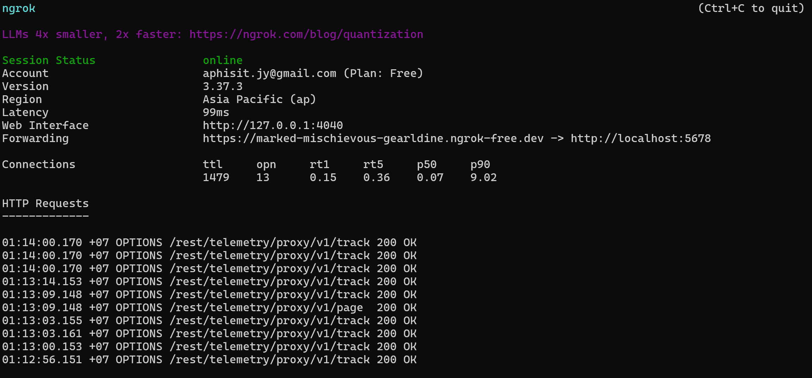
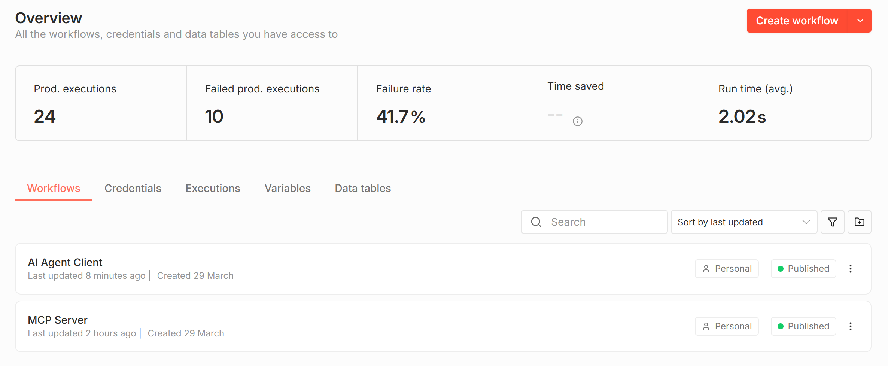
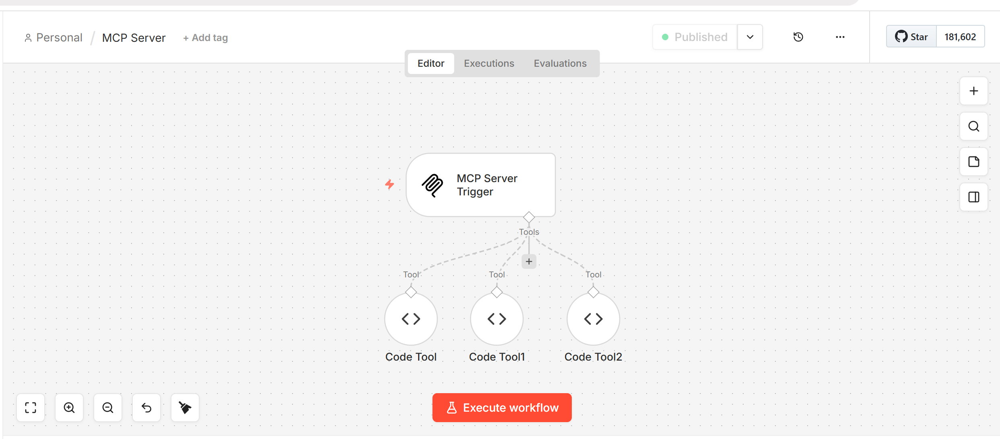
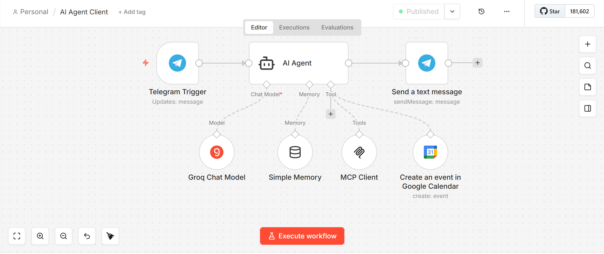
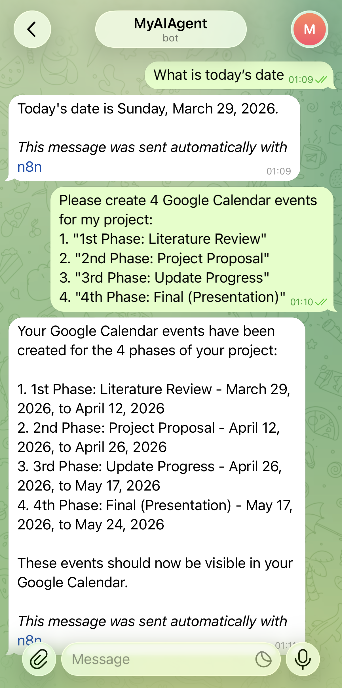
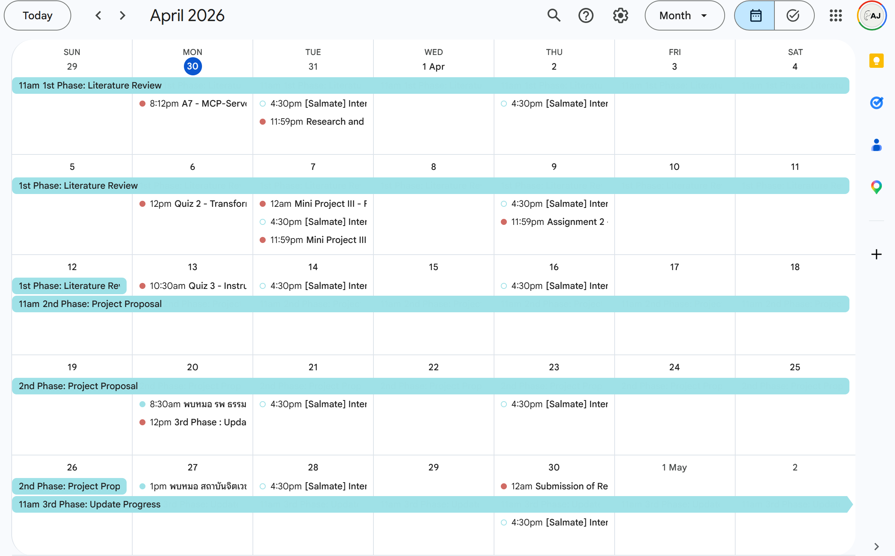

# A7: MCP-Server, AI Agent, and External Tool Integration

**Course:** AT82.05 Artificial Intelligence: Natural Language Understanding (NLU)  
**Assignment:** A7 — MCP-Server, AI Agent, and External Tool Integration  
**Student:** Aphisit Jaemyaem st126130

---

## Overview

This assignment builds an integrated AI Agent ecosystem using the **Model Context Protocol (MCP)**. The system connects an n8n-based AI Agent to Telegram and Google Calendar, enabling natural language scheduling and real-time communication.

**Key technologies used:**
- [n8n](https://n8n.io/) — workflow automation platform (deployed via Docker)
- [ngrok](https://ngrok.com/) — tunnel for exposing local n8n to the internet
- [Groq](https://console.groq.com/) — free LLM API (llama-3.3-70b-versatile)
- Telegram Bot API — messaging interface
- Google Calendar API — event management

---

## Task 1: MCP Infrastructure & Server Setup

### 1.1 Server Deployment
n8n was deployed locally using Docker and exposed to the internet via ngrok.

**Run n8n:**
```bash
docker run -it --rm --name n8n -p 5678:5678 \
  -v n8n_data:/home/node/.n8n \
  -e WEBHOOK_URL=https://<your-ngrok-url> \
  n8nio/n8n
```

**Run ngrok:**
```bash
.\ngrok http 5678
```

**Screenshot — ngrok running:**



**Screenshot — n8n Overview (both workflows Published):**



---

### 1.2 MCP Server Workflow
An n8n workflow acts as an MCP Server with **3 internal tools**:
- `Code Tool` — Calculator
- `Code Tool1` — Date/Time
- `Code Tool2` — Text Formatter

**Screenshot — MCP Server Workflow:**



---

### 1.3 AI Agent Client
A separate AI Agent workflow was configured with:
- **Model:** Groq (`llama-3.3-70b-versatile`)
- **Memory:** Simple Memory (Window Buffer)
- **Tools:** MCP Client connected to MCP Server Production URL

**Screenshot — AI Agent Client Workflow:**



---

## Task 2: Telegram & Google Calendar Integration

### 2.1 Telegram Bot Integration
The AI Agent is connected to a Telegram bot via **Telegram Trigger**, enabling it to receive and reply to messages directly.

### 2.2 Google Calendar Tool
The **Google Calendar** tool was integrated into the AI Agent, allowing it to create, read, and manage events on behalf of the user.

### 2.3 Automated Project Scheduling
The agent was instructed via Telegram to create a 4-phase project schedule:

| Phase | Event Name | Period |
|-------|-----------|--------|
| 1st | Literature Review | Mar 29 – Apr 12, 2026 |
| 2nd | Project Proposal | Apr 12 – Apr 26, 2026 |
| 3rd | Update Progress | Apr 26 – May 17, 2026 |
| 4th | Final (Presentation) | May 17 – May 24, 2026 |

**Screenshot — Telegram Conversation:**



**Screenshot — Google Calendar Events:**



### 2.4 Interaction Verification
The agent successfully:
1. Received commands from Telegram
2. Created 4 events in Google Calendar
3. Confirmed the events back to the user via Telegram

---

## Workflow Files

| File | Description |
|------|-------------|
| `workflows/mcp_server.json` | MCP Server workflow (exported from n8n) |
| `workflows/ai_agent_client.json` | AI Agent Client workflow (exported from n8n) |

---

## Setup Instructions

### Prerequisites
- Docker Desktop
- ngrok account (free tier)
- Groq API key ([console.groq.com](https://console.groq.com/))
- Telegram Bot Token (via [@BotFather](https://t.me/BotFather))
- Google Calendar OAuth credentials

### Steps
1. Start n8n with Docker (see command above)
2. Run ngrok: `.\ngrok http 5678`
3. Import `workflows/mcp_server.json` into n8n → Publish
4. Import `workflows/ai_agent_client.json` into n8n → Publish
5. Update MCP Client Endpoint URL with ngrok Production URL
6. Configure credentials: Groq, Telegram, Google Calendar
7. Send a message to your Telegram bot to test

---

## References
- [n8n Local Setup](https://github.com/chaklam-silpasuwanchai/Python-fo-Natural-Language-Processing/tree/main/Code/11%20-%20Agentic%20AI/local-n8n)
- [Groq API](https://console.groq.com/)
- [n8n MCP Documentation](https://docs.n8n.io/)
